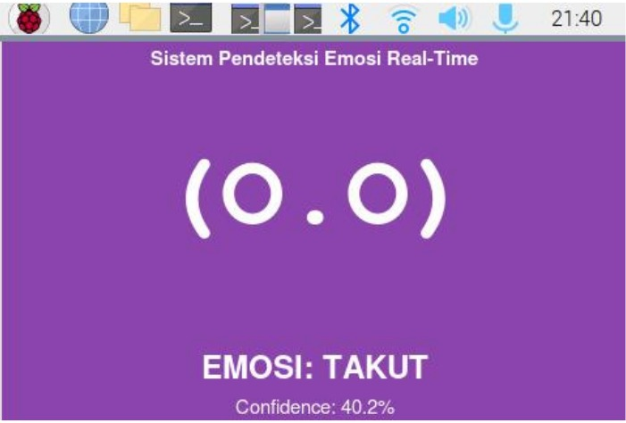
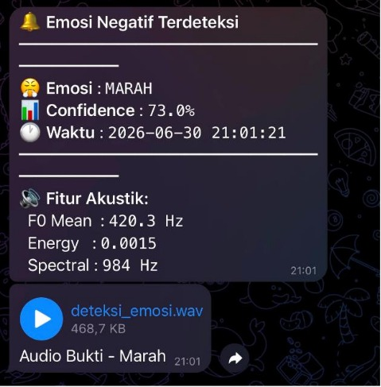
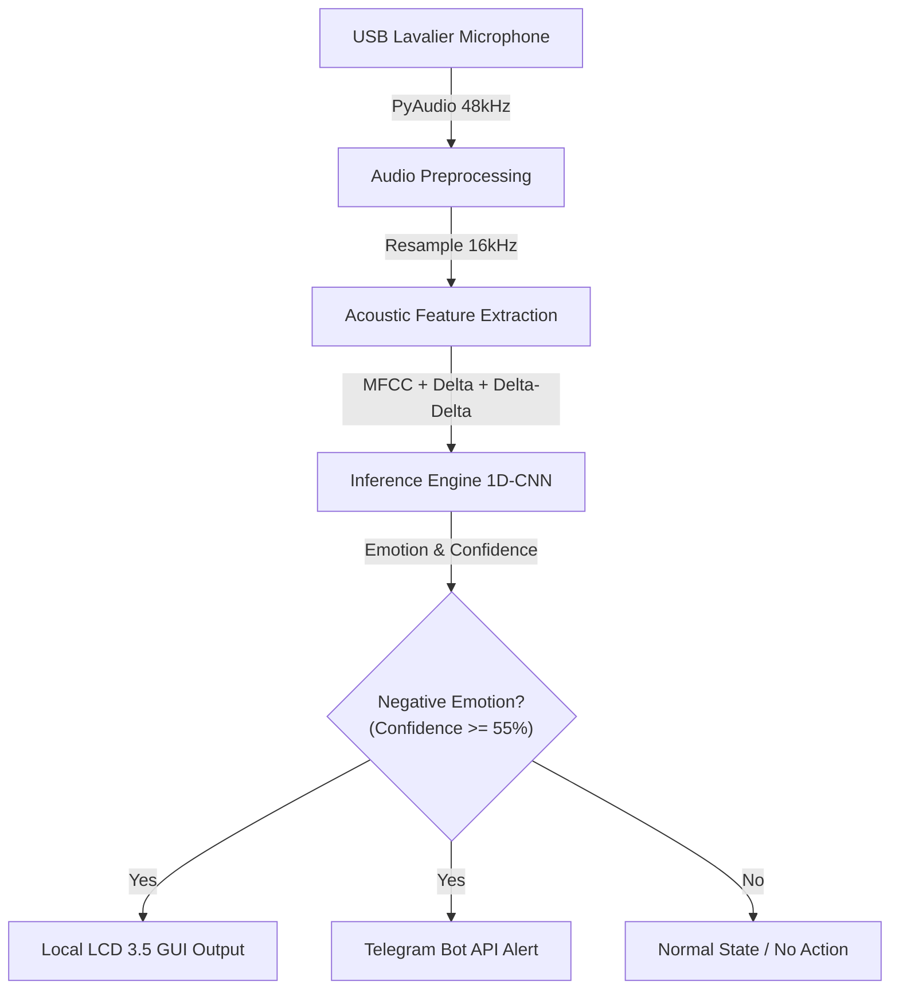

# 🗣️ Real-Time Negative Speech Emotion Recognition (NSER)

An end-to-end embedded machine learning system designed to detect negative emotions (anger, fear, sadness, and disgust) from ambient speech in real-time, functioning as an early crime and danger warning system for the Indonesian language.

This project is deployed on a **Raspberry Pi 4 Model B** utilizing a lightweight **1D-CNN model (TFLite INT8)**, equipped with a 3.5-inch touch LCD GUI and automated **Telegram Bot API** alerts.

---

## 📷 System Interface & Alerts

### 1. Real-Time GUI Display (Raspberry Pi LCD)


> *Compact Tkinter graphical user interface running on a 3.5-inch touch LCD (480x320 resolution) attached to the Raspberry Pi, displaying live emotion classification, confidence scores, and real-time acoustic feature validation.*

### 2. Telegram Bot Notification


> *Automated early warning notification sent instantly to Telegram whenever a negative emotion is detected, complete with confidence metrics, acoustic feature logs (F0 Mean, Energy, Spectral Centroid), and audio evidence.*

---

## 🧠 Overview

The system captures live audio streams through a USB microphone, processes the signal in sliding windows, extracts multi-dimensional acoustic features, and performs lightweight inference on the edge device. 

**Why Real-Time NSER on Edge Devices?**
Relying on cloud processing for safety-critical early warning systems introduces latency and privacy vulnerabilities. By quantizing the trained 1D-CNN model into **TFLite INT8 format**, this system runs entirely offline on a low-power Raspberry Pi 4, achieving rapid inference times (<200 ms) and immediate local/remote response capabilities.

### Architecture



---

## ✨ Features Achieved

- **Real-Time Edge Inference** — Fully operational on a Raspberry Pi 4 Model B using an optimized 1D-CNN TFLite INT8 model.
- **Multi-Feature Representation** — Extracts 180 acoustic dimensions combining MFCCs, Chroma, and Mel-Spectrograms.
- **Embedded Touch GUI** — Tailored Tkinter interface optimized for a 3.5-inch TFT LCD (480x320 pixels) showing live status and acoustic validation scores.
- **Automated Telegram Alerts** — Instant push notifications dispatched via Telegram Bot API with a built-in 30-second cooldown mechanism to prevent spam.
- **High Accuracy Model** — Built upon a validated dataset of Indonesian movie audio tracks, achieving 94.13% classification accuracy during training.

---

## 🛠️ Tech Stack

| Layer | Technology |
|---|---|
| Hardware | Raspberry Pi 4 Model B (4GB RAM), USB Lavalier Microphone L20, 3.5" TFT LCD Display |
| Operating System | Raspberry Pi OS (64-bit, Headless / GUI Mode) |
| Environment | Python 3.7+ |
| Audio Processing | Librosa, PyAudio, NumPy |
| Deep Learning Model | TensorFlow / Keras (Quantized to TFLite INT8) |
| Graphical Interface | Tkinter (Python GUI Framework) |
| Communication API | Telegram Bot API (`requests`) |

---

## 📁 Project Structure

```text
.
├── model/
│   └── cnn1d_ser_int8.tflite    # Quantized 1D-CNN model for inference
├── Output.jpeg                  # GUI display documentation image
├── Telegram_Result.jpeg         # Telegram notification documentation image
├── realtime_ser.py              # Main real-time execution script
├── LICENSE
└── README.md
```

---

## 🚀 Getting Started

### Prerequisites

- Raspberry Pi 4 Model B running Raspberry Pi OS.
- USB Lavalier Microphone connected to a USB port.
- 3.5-inch RPi Display connected via 40-pin GPIO header.
- Python 3.7+ installed.

### Installation

1. Clone the repository:
   ```bash
   git clone [https://github.com/ramailham23/negative-speech-emotion-recognition.git](https://github.com/ramailham23/negative-speech-emotion-recognition.git)
   cd negative-speech-emotion-recognition
   ```
2. Install required Python libraries:
   ```bash
   pip install numpy librosa pyaudio requests tflite-runtime
   ```
   *(Note: If `tflite-runtime` is unavailable on your system architecture, standard `tensorflow` can be used).*

### Configuration

1. Open `realtime_ser.py` and configure your Telegram bot credentials if you wish to receive live alerts:
   ```python
   TELEGRAM_TOKEN = 'YOUR_TELEGRAM_BOT_TOKEN'
   TELEGRAM_CHAT_ID = 'YOUR_CHAT_ID'
   ```
2. Ensure the TFLite model file (`cnn1d_ser_int8.tflite`) is correctly placed inside the `model/` folder.

### Running the System

Execute the main real-time program:

```bash
python3 realtime_ser.py
```

The Tkinter application will automatically launch on your 3.5-inch LCD screen, start listening through the USB microphone, and monitor ambient speech for negative emotions.

---

## 📝 Notes & Limitations

- **Acoustic Environment:** External environmental noise or heavy room reverberation can occasionally cause false positives. Utilizing directional microphones with good signal-to-noise ratios (SNR) yields the best classification results.
- **Semantic Context:** Because the system relies purely on acoustic and spectral features without a Speech-to-Text (STT) or NLP semantic validator, high-energy speech (such as shouting in a playful context) may occasionally trigger a negative emotion classification.

---

## 📚 What I Learned

Building this real-time embedded system provided deep insights into edge AI engineering:
- The importance of model quantization (converting models to TFLite INT8) to drastically reduce latency and memory overhead on resource-constrained single-board computers like the Raspberry Pi.
- Designing multi-threaded Python architectures (`AudioCapture`, `InferenceEngine`, and GUI event loops) to handle continuous audio streams without dropping frames or freezing user interfaces.
- Bridging machine learning inference outputs with hardware displays and cloud APIs (Telegram) to create practical, end-to-end IoT safety prototypes.

---

## 📄 License

This project is open source under the [MIT License](LICENSE).

---

## 👤 Author

**Moh. Ilham Ramadan (Rama)**  
*Telecommunication Engineering, Politeknik Elektronika Negeri Surabaya (PENS)*  
Embedded Systems, IoT & Machine Learning Enthusiast

- GitHub: [@ramailham23](https://github.com/ramailham23)
